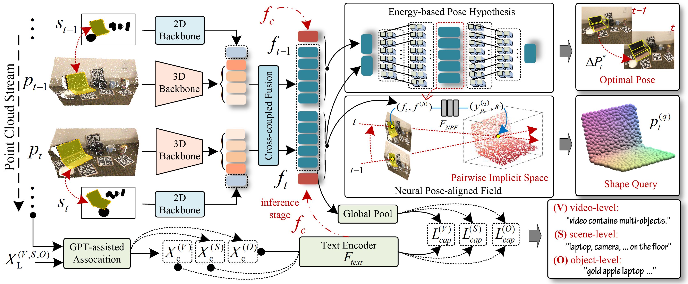
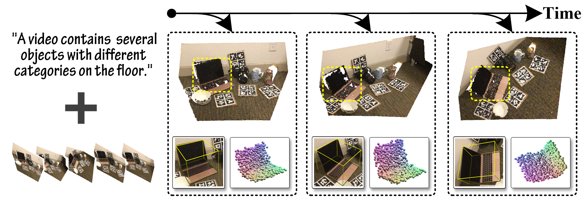
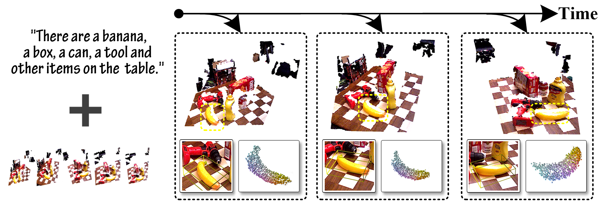

# L4D-Track: Language-to-4D Modeling Towards 6-DoF Tracking and Shape Reconstruction in 3D Point Cloud Stream
This is the official implementation of our paper L4D-Track: Language-to-4D Modeling Towards 6-DoF Tracking and Shape Reconstruction in 3D Point Cloud Stream 

# Abstract
> 3D visual language multi-modal modeling plays an important role in actual human-computer interaction. However, the inaccessibility of large-scale 3D-language pairs restricts their applicability in real-world scenarios. 
In this paper, we aim to handle a real-time multi-task for 6-DoF pose tracking of unknown objects, leveraging 3D-language pre-training scheme from a series of 3D point cloud video streams, while simultaneously performing 3D shape reconstruction in current observation. To this end, we present a generic Language-to-4D modeling paradigm termed L4D-Track, that tackles zero-shot 6-DoF Tracking and shape reconstruction by learning pairwise implicit 3D representation and multi-level multi-modal alignment. Our method constitutes two core parts. 1) Pairwise Implicit 3D Space Representation, that establishes spatial-temporal to language coherence descriptions across continuous 3D point cloud video. 2) Language-to-4D Association and Contrastive Alignment, enables multi-modality semantic connections between 3D point cloud video and language. Our method trained exclusively on public NOCS-REAL275 dataset, achieves promising results on both two publicly benchmarks. This not only shows powerful generalization performance, but also proves its remarkable capability in zero-shot inference.

    The overall framework.

# Visualization Results

    The results of Unseen objects with known categories.

    The results of Unseen objects with unknown categories.

## Other Results

# Requirements
- Linux (tested on Ubuntu 20.04)
- Python 3.6.13
- CUDA 11.3
- PyTorch 1.7.1
  
# Installation
~~~
conda create -n l4dtrack python=3.6

conda activate l4dtrack

conda install pytorch==1.7.1 torchvision==0.8.2 torchaudio==0.7.2 cudatoolkit=11.0 -c pytorch

pip install -r requirements.txt
~~~

# Dataset

## NOCS-REAL275 Dataset

Download real_test, real_train, ground-truth annotations and mesh models provided by [NOCS](https://github.com/hughw19/NOCS_CVPR2019).
Then process these files following [SPD](https://github.com/mentian/object-deformnet). And download segmentation results from Mask R-CNN, and predictions of NOCS from [SPD](https://github.com/mentian/object-deformnet).
The dataset is organized as follows:
~~~

── NOCS275
    ├── Real
    ├── gts
          └── mrcnn_results
          └── nocs_results
          └── SGPA_results
          └── 6D-ViT_results
    ├── obj_models

~~~

## YCB-Video Dataset
Training and Testing sets follow [PoseCNN](https://github.com/yuxng/PoseCNN). The training set includes 80 training videos 0000-0047 & 0060-0091 and synthetic data 000000-079999. The testing set includes 2949 keyframes from 10 testing videos 0048-0059. The corresponding file organization as follows:
~~~

── YCB-Video
    ├── data
    ├── models
    ├── classes.txt
    ├── keyframe.txt
    ├── train_data_list.txt
    ├── test_data_list.txt

~~~

## Dataset processing
We need to execute the following script to generate the train and test data list and their label.pkl.
~~~
python dataset/real275_data_preprocess.py
~~~
We also need to execute the following script to generate the corresponding caption embeedings as JSON format.
~~~
python models\video_language_model\save_capthon_embeddings.py
~~~

# Evaluation

Then, you can make an evaluation for NOCS-REAL275 using following command.
~~~
python evaluate_pose_nocs.py
~~~
Then, you can make an evaluation for YCB-Video using following command.
~~~
python evaluate_pose_ycbvideo.py
~~~

You can get running speed at the same time.

# Train
You can train using the following command.
~~~
python train_model.py --gpu 0,1,2,3
~~~
You can modity the training config in the demo.

# Ackownledgment
(1) The training dataset is provided by [NOCS](https://github.com/hughw19/NOCS_CVPR2019). 

(2) Our code is developed based on [Pointnet2.PyTorch](https://github.com/sshaoshuai/Pointnet2.PyTorch), [SPD](https://github.com/mentian/object-deformnet)， [CLIP](https://github.com/openai/CLIP) and [SGPA](https://github.com/ck-kai/SGPA).

(3) The completed code will be updated when the paper is accepted.
